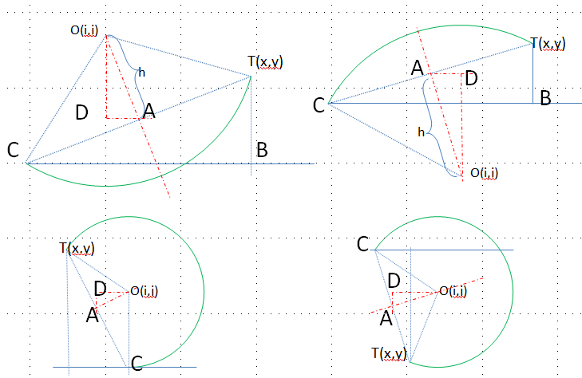
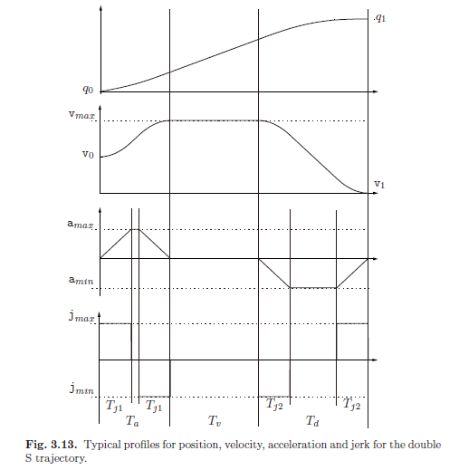

实现过程中，几个算法推导记录。

# 1.已知轴向约束，推算任意方向上的约束值

条件：

已知各个轴向的最大加速度,以及定义方向的单位向量，标记为：

$$
\overrightarrow{acc_{max}}  = (accx_{max},accy_{max},accz_{max})$\\
\overrightarrow{unit}  = (x_u,y_u, z_u)$
$$

在该条件下求解在定义的方向上最大允许加速度会是多少。

根据向量的DOT运算可以求解一个向量在另外一个向量上的投影，假设最终求解到的加速度为: 

$$
\overrightarrow{ACC} = (acc_x,acc_y,acc_z) = A(x_u,y_u, z_u) \\
$$


该向量投影到x轴的投影（标量）是：

$$
\overrightarrow{ACC} \bullet (1,0,0) = |\overrightarrow{ACC} |\times  cos\theta = 投影到x轴的投影值 \\
$$
根据DOT运算结果，以及轴向加速度约束，可以得到以下约束：
$$
\overrightarrow{ACC} \bullet (1,0,0) = acc_x = A \times x_u \\
A \times x_u  < accx_{max}
$$

对y轴，z轴进行相同的分析，最终可以得到以下约束组合：

$$
\begin{cases}
& A \times x_u  < accx_{max}   \\
& A \times y_u  < accy_{max}   \\
& A \times z_u  < accz_{max}   \\
\end{cases}
$$

从求解$A$的角度，根据上面的分析我们可以采用下面的计算来得到 $A$

$$
A = min(\cfrac{accx_{max}}{x_u}, \cfrac{accy_{max}}{y_u}, \cfrac{accz_{max}}{z_u})
$$

结论：

已知$\overrightarrow{unit}$  与$\overrightarrow{acc_{max}}$ ，在任意方向的约束向量$\overrightarrow{ACC}$，约束值$A$为：

$$
\begin{cases}
& \overrightarrow{acc_{max}}  = (accx_{max},accy_{max},accz_{max})  \\

& \overrightarrow{unit}  = (x_u,y_u, z_u) \\
& A = min(\cfrac{accx_{max}}{x_u}, \cfrac{accy_{max}}{y_u}, \cfrac{accz_{max}}{z_u}) \\
& \overrightarrow{ACC} = A \times \overrightarrow{unit}  \\
\end{cases}
$$

# 2.圆弧插补

rs274规范中定义两种圆弧插补：
```text
    G2 = 20, /*G02------顺时针方向圆弧插补 G2 circular/helical
             interpolation (clockwise)           */
    G3 = 30, /*G03------逆时针方向圆弧插补 G3 circular/helical
             interpolation (counterclockwise)    */
```
The axis of the circle or helix must be parallel to the X, Y, or Z-axis of the machine coordinate
system. The axis (or, equivalently, the plane perpendicular to the axis) is selected with G17 (Zaxis,
XY-plane), G18 (Y-axis, XZ-plane), or G19 (X-axis, YZ-plane). If the arc is circular, it lies
in a plane parallel to the selected plane.

Two formats are allowed for specifying an arc. We will call these the center format and the radius.

## radius format

典型gcode指令例子：`G17 G2 x 10 y 15 r 20 z 5`, G17 is XY-plane selection", and G2 is clockwise circular。 so this example means to "make a clockwise (as viewed from the positive Z-axis) circular or helical arc whose axis is parallel to the Z-axis, ending where X=10, Y=15, and Z=5, with a radius of 20."

如上描述，在radius format格式指令下，是不会告知圆心坐标的。下面我们将推导在已知起始、终点，半径，方向这些条件下如何推导圆心的坐标。



```text
                                 O <- [i,j]
                              -  |
                    r      -     |
                        -        |
                     -           | h
                  -              |
    [0,0] ->  C -----------------+--------------- T  <- [x,y]
              | <------ d/2 ---->|

C - Current position
T - Target position
O - center of circle that pass through both C and T
d - distance from C to T
r - designated radius
h - distance from center of CT to O
```
按照几何关系，可以得出下面的等式：
$$d^2 == x^2 + y^2$$
$$h^2 == r^2 - (\cfrac{d}{2})^2$$

CCW场景下，根据相似三角形可以得到$\cfrac{DA}{h} = \cfrac{y}{d}$,即$DA=\cfrac{y}{d} * h$,所以:
$$i ==\cfrac{x}{2} - DA ==\cfrac{x}{2} - \cfrac{y}{d} *h$$

CCW场景下，同样根据相似三角形可以得到$\cfrac{OD}{h}=\cfrac{x}{d}$，即$OD=\cfrac{x}{d}*h$,所以
$$j == \cfrac{y}{2} + OD == \cfrac{y}{2} + \cfrac{x}{d} *h$$

进一步简化可以得到:
$$d == \sqrt{x^2 + y^2}$$
$$h == \cfrac{ \sqrt{4 * r^2 - x^2 - y^2} }{2}$$

CW，CCW场景下，进一步简化可以得到:
$$i == \cfrac{ x \mp (y * \sqrt{4 * r^2 - x^2 - y^2}) / \sqrt{x^2 + y^2} }{ 2 },CCW场景下为“-”$$
$$j == \cfrac{ y \pm (x * \sqrt{4 * r^2 - x^2 - y^2}) / \sqrt{x^2 + y^2} }{ 2 },CW场景下为“+”$$

## Center Format

典型gcode指令例子：`G17 G2 x 10 y 16 i 3 j 4 z 9`, G17 is XY-plane selection", and G2 is clockwise circular。 so this example means to "make a clockwise (as viewed from the positive z-axis) circular or helical arc whose axis is parallel to the Z-axis, ending where X=10, Y=16, and Z=9, with its center offset in the X direction by 3 units from the current X location and offset in the Y direction by 4 units from the current Y location. If the current location has X=7, Y=7 at the outset, the center will be at X=10, Y=11. If the starting value of Z is 9, this is a circular arc; otherwise it is a helical arc. The radius of this arc would be 5."


$$
\vec{F}=m\vec{a}  \\
$$

根据外积（叉积）的定义有：
$$
\left |\vec{r} \times \vec{rt} \right | 
    = \left | r \right | \left | rt \right | sin\theta
$$

根据内积（点积）的定义有：

$$
\vec{r} \cdot \vec{rt} = \left | r \right | \left | rt \right | cos\theta 
   = x_r x_{rt} + y_r y_{rt}
$$ 

因此向量$\vec{r}$ 与向量$ \vec{rt}之间的夹角可以表示为$atan2(|\vec{r}  \times \vec{rt}| ,\vec{r} \cdot \vec{rt})$

总结： 

假设向量$A(x_0,y_0)$与向量$B(x_1,y_1)$, 向量$A$,$B$之间夹角$\theta$为：$\theta =arctan \cfrac{x_0 y_1 - x_1 y_0}{x_0 x_1 + y_0 y_1}$, 推导过程见"`##I-a: tan 与arctan`"


人为设定：$arc\_tolerance$为圆弧上任意两点连接而成的小线段到圆弧的最大距离. 

$$k^{2}=radius^2 - (radius - arc\_tolerance)^2=arc\_tolerance*(2*radius - arc\_tolerance)$$

对应的弧长为：$2* atan2(k, radius - arc\_tolerance) * radius$

$$segments = \cfrac{0.5*angular\_travel * radius}{ atan2(k, radius - arc\_tolerance) * radius}$$


# Trapezoidal步间延迟推导

Trapezoidal 特点如下：

```text
    /**
     * Trapezoidal acceleration：
     *    │
     *    xxxxxxxxxx
     *    │
     * ───┼─────────xxxxxxxxxx──────────────
     *    │
     *    │                   xxxxxxxxxxx
     *    │
     */
```

以下讨论内容，专注于stepper motor场景,因此预先统一两个概念：
- 步间延迟，ith delay是指任意相邻两个pluse之间的间隔时间(time delays  between step pulses)。 在本讨论中不考虑"PLUSE length"，因为它与我们的推导无关。在使用时，可以通过类似"delays - pluse-length"的方式得到单脉冲后实际延迟多长时间得到实际脉冲的占空长度。
- 距离，在stepper motor场景，每走one step，就代表距离1.

```text
     │ith delay│
     ├─────────┤
     ┌─┐       ┌─┐       ┌─┐       ┌─┐
   ──┘ └───────┘ └───────┘ └───────┘ └─
     i-1       i
```

结合前面列出的基本速度公式，在stepper motor场景可以得到以下关系：

- $v_0$ - base speed, unit is steps per unit-time
- $v_i$ - slew speed for the i-th step, unit is steps per unit-time
$$
\begin{cases}
& v_0 : initial velocity, base speed \\
& v_i = \sqrt{v^2_{i-1} + 2*a} ,i=1,2,...:[1]iteration formula
\end{cases}
$$

如前面示意图，对第$i$ step, 定义它的步间延迟是：第$i-1$ step与第$i$ step间的time delay。根据我们前面的约定，我们可以得到步间延迟的公式：
- $p_i$ - delay period for the i-th step (unit is unit-time same as velocity),
$$
v_i = \cfrac{1}{p_i} \Rightarrow p_i = \cfrac{1}{v_i}, [2]
$$

代入`[1]`公式，可以得到:

$$

\cfrac{1}{p_i} = \sqrt{ (\cfrac{1}{p_{i-1}})^2 +2a }
               = \cfrac{\sqrt{1+2ap^2_{i-1}}}{p_{i-1}}
$$

最后化简结果是：
$$
\begin{cases}
& p_1 = \cfrac{1}{ \sqrt{v^2_0 +2a} }   \\
& p_i =  \cfrac{p_{i-1}}{\sqrt{1+2a*p^2_{i-1}}},i=2,3...:[3]iteration formula
\end{cases}

$$

根据以上的初始值与迭代公式，我们已经可以计算步间延迟，但考虑到性能，我们下一步考虑去掉迭代中的sqrt计算。

考虑到[taylor series of 1/sqrt(1+x)](https://www.wolframalpha.com/input?i=taylor+series+of+1%2Fsqrt%281%2Bx%29)展开的特点，$\cfrac{1}{\sqrt{1+x}} \approx 1-\cfrac{x}{2}+\cfrac{3x^2}{8}$, taylor展开在$[-1,1]$区间有很好的近似性，我们首先来判断下$\cfrac{1}{\sqrt{1+2a*p^2_{i-1}}}$是否在我们希望的$[-1,1]$区间。

根据式子$[2]$,显然我们是需要判断$x=\cfrac{2a}{v^2_{i-1}}$是否满足区间要求. 因此一般化来说，$x$的范围应该是：

$$
x \in [\cfrac{2a}{v^2_{max}},\cfrac{2a}{v^2_{min}} ]
$$

不失一般性，我们可以仅仅在forward-only情境下分析，当然如果仅仅在backward-only场景下考虑也是一样的。 

在$v_1,v_2,...$中， 

$$
\begin{cases}
& 如果是加速度为正，那么v_{min}=v_1=\sqrt{v^2_0 +2a}; 结论：x \in (0,\cfrac{2a}{v^2_0 +2a}] \in (0,1]\\
& 如果加速度为负，v_{max}=v_1=\sqrt{v^2_0 +2a}; 结论：x \in [\cfrac{2a}{v^2_0 +2a},0) \in [-1,0)
\end{cases}
$$

因此我们可以放心的使用taylor展开，因为其满足区间条件具有较好近似性。


最终结果就是：

$$
约定：R= a \\

\begin{cases}
 & intital: p_1 =  \cfrac{1}{\sqrt{v^2_0 +2a}}\\
 & p_i=p_{i-1} (1+m*p^2_{i-1}) \text{,采用二级展开} \\ 
 & p_i=p_{i-1} (1+m*p^2_{i-1} + \cfrac{3}{2}(m*p^2_{i-1})^2)   \text{,采用三级展开}
\end{cases}
$$
- 其中$m$的取值采用：
$$
\begin{cases}
 & m=-R \text{, if during acceleration phase} \\ 
 & m=0  \text{, if between acceleration and deceleration phases} \\ 
 & m=R  \text{,if during deceleration phase}
\end{cases}
$$

注：
- $p_i$单位是unit-time,与velocity unit-time单位相同，例如:如果速度单位是steps per second, 那$p_i$单位就是second；如果如果速度单位是steps per minutes, 那$p_i$单位就是minute.

- 

# S型加减速(S-curve or double S）

内容见[3.4 Trajectory with Double S Velocity Profile](Trajectory_Planning_for_Automatic_Machines_and_Robots.pdf)

约定：
- $T_{j1}$ : time-interval in which the jerk is constant (jmax or jmin) during the
acceleration phase;
- $T_{j2}$ : time-interval in which the jerk is constant (jmax or jmin) during the
deceleration phase;
- $T_a$ : acceleration period;
- $T_v$ : constant velocity period;
- $T_d$ : deceleration period;
- T : total duration of the trajectory ($= T_a + T_v + T_d$).
- $j_{max};a_{max};v_{max};h=q_1-q_0$: maximum values of jerk, acceleration and velocity  and desired displacement


从上图可知，从速度veclocity角度，整个路径可以分为以下三个阶段：

-  Acceleration phase, t ∈ [0, Ta], where the acceleration has a linear profile from the initial value (zero) to the maximum and then back to zero.
$
t \in [0,T_{j1}] \Rightarrow
\begin{cases}
& q(t) = q_0 + v_0*t +j_{max}\cfrac{t^3}{6} \\
& q'(t) = v_0 +j_{max}\cfrac{t^2}{2} \\
& q''(t) =j_{max}*t \\
& q''(t) =j_{max}*t \\
& q'''(t) = j_{max}
&
\end{cases}
$

$
t \in [T_{j1}, T_a - T_{j1}] \Rightarrow
\begin{cases}
& q(t) = q_0 + v_0*t +\cfrac{a_{lim}}{6}(3t^2 -3T_{j1}t + T^2_{j1}) \\
& q'(t) = v_0 +a_{lim} (t - \cfrac{T_{j1}}{2}) \\
& q''(t) =j_{max}*T_{j1}=a_{lim} \\
& q'''(t) = 0
&
\end{cases}
$

$
t \in [T_a - T_{j1}, T_a] \Rightarrow
\begin{cases}
& q(t) = q_0 + (v_{lim}+v_0)\cfrac{T_a}{2} - v_{lim}*(T_a-t) - j_{min} \cfrac{(T_a-t)^3}{6} \\
& q'(t) = v_{lim} + j_{min} \cfrac{(T_a-t)^2}{2} \\
& q''(t) = -j_{min}*(T_a -t) \\
& q'''(t) = j_{min} = - j_{max}
&
\end{cases}
$


- 2. Maximum velocity phase, t ∈ [Ta, Ta + Tv], with a constant velocity.

$$
t \in [T_a, T_a + T_{v}] \Rightarrow
\begin{cases}
& q(t) = q_0 + (v_lim+v_0)\cfrac{T_a}{2} - v_{lim}*(T_a-t)  \\
& q'(t) = v_{lim} \\
& q''(t) = 0 \\
& q'''(t) = 0
&
\end{cases}
$$


- 3. Deceleration phase, t ∈ [Ta+Tv, T], being T = Ta+Tv +Td, with profiles opposite with respect to the acceleration phase.


# I:公式推导

## I-a: tan 与arctan

基本三角公式有：

$$tan(\alpha \pm \beta)=\cfrac{ tan(\alpha) \pm tan(\beta) }{1 \mp  tan(\alpha)tan(\beta)}$$

$$arctan(A) \pm arctan(B) = arctan \cfrac{A \pm B}{ 1 \mp AB } $$

假设向量$A(x_0,y_0)$与向量$B(x_1,y_1)$, 向量$A$,$B$之间夹角$\theta$

$$\angle A= arctan(\cfrac{y_0}{x_0}), \angle B=arctan(\cfrac{y_1}{x_1})$$

因此:
$$\angle B - \angle A = arctan(\cfrac{y_1}{x_1}) - arctan(\cfrac{y_0}{x_0})$$

采用基本三角公式，泽得到下面结果

$$\angle B - \angle A =arctan \left ( \cfrac{ \cfrac{y_1}{x_1} - \cfrac{y_0}{x_0}}{1 + \cfrac{y_1}{x_1} \cfrac{y_0}{x_0}} \right )$$

$$\angle B - \angle A =arctan \cfrac{x_0 y_1 - x_1 y_0}{x_0 x_1 + y_0 y_1}$$


## 2.0.基本速度公式
```text
S - acceleration distance
t - acceleration time, ramping period, unit is unit-time. e.g. second,minute, and so on
v0 - initial velocity, base speed, unit is distance per unit-time
v - target velocity, slew speed, unit is distance per unit-time
a - acceleration, , unit is distance per (unit-time)^2
```

$$
S = v_0*t +  \cfrac{1}{2} a*t^2  \\
v=v_0 +a*t \Rightarrow t=\cfrac{v-v_0}{a}
$$

re arrange format is:

$$
S = \cfrac{v^2 -v^2_0}{2*a}  \\
v = \sqrt{v^2_0 + 2*a*S}
$$ 

## 3.0.法向加速度

- $a_n$: 向心加速度
- $F_n$: 向心力
- $v$: 切向速度
- $r$ ： 半径

$$
a_n = \cfrac{F_n}{m} \\
    = 4 \pi^2f^2r
    =\cfrac{v^2}{r}=\omega^2r=v\omega
$$

下面是标量向心加速的的推导过程, ：

$$
\vec{p} = r.cos(\theta)\hat{i} + r.sin(\theta)\hat{j} \\

\vec{v}(t) =  \cfrac{d \vec{p}}{dt} = r(-sin(\theta(t)))\cfrac{d\theta}{dt}\hat{i} + r(cos(\theta(t)))\cfrac{d\theta}{dt}\hat{j} \\

= r\omega(-sin(\theta(t)))\hat{i} + r\omega cos(\theta(t))\hat{j} \\

\vec{a}(t) = \cfrac{d \vec{v}}{dt} = -r\omega(cos(\theta(t))) \omega \hat{i} - r\omega sin(\theta(t)) \omega \hat{j} \\
   = -\omega^2 r ( cos(\theta(t)) \hat{i} + sin(\theta(t)) \hat{i} )  \\

   = - \omega^2 \vec{p}(t) \\
$$
因此可以得到：
$$
a_n= ||\vec{a}(t) || = ||- \omega^2 \vec{p}(t)||=\omega^2 r \\

= (\cfrac{v}{r})^2 r
$$


```text

```

- 向心加速度，也叫做法向加速度，是质点作曲线运动时，指向圆心（曲率中心）的加速度，与曲线切线方向垂直。向心加速度是反映圆周运动速度方向变化快慢的物理量。向心加速度只改变速度的方向，不改变速度的大小。


      init/max velocity─────xxxxxxxxxxxxxx────────────────────
                                          x
                                           x
                                            x end velocity


       max velocity ───────xxxxxxxxxxxxxxxx───────────────────
                          x                x
                         x                  x
                        x                    x end velocity
                      x
       init velocity┼x────────────────────────────────────────


       max velocity ─────xxxxxxxxxxxxxxxxxx───────────────────
                        x                  x
                      x                      x
       init velocity┼x────────────────────────x───────────────
                                               x
                                                x end velocity

